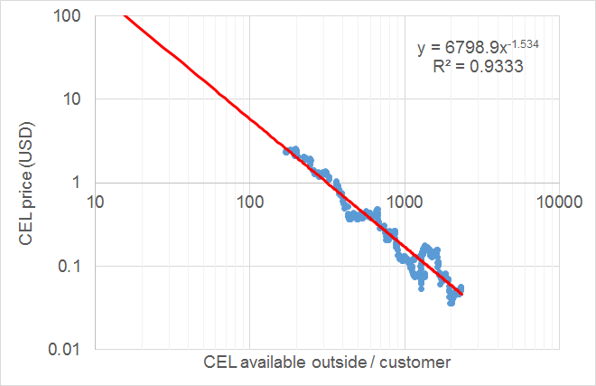
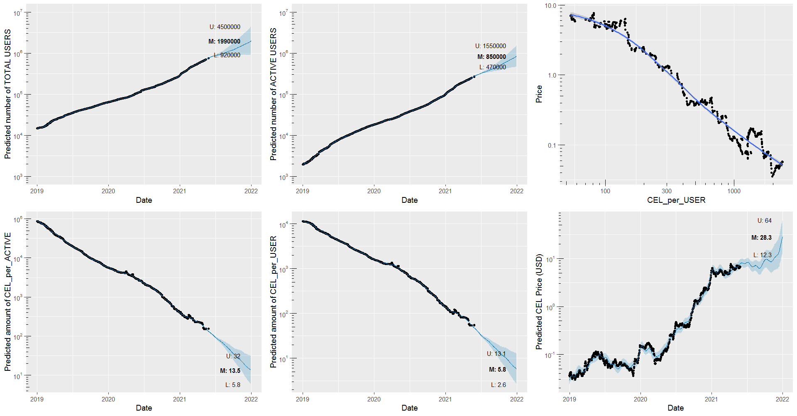

# Celsius Network token (CEL) price forecast
Predicting the [Celsius Network](https://celsius.network) growth and the [CEL token](https://celsius.network/cel-token-explained/) price using 'black-box' time-series prediction modeling framework by Facebook's [Prophet](https://facebook.github.io/prophet/).

## Short intro to the Celsius Network

The Celsius Network is a unique crypto "bank" of the future, offering highly secure custodianship, lending, and borrowing services with market-leading high yields on deposited crypto assets , low rates on borrowed assets, and sharing of up to 80% of the revenue with the community of its members. 

The network has grown exponentially in the last year. Currently (end May 2021), it boasts:

- 750k members, 270k of them with active wallets (non-zero funds).
- 21.3 billion USD total community assets under management.

In the last 12 months the network has:

- distributed 350 million USD in rewards to its members.
- paid 7 million USD in blockchain network fees (withdrawals are free).

## The CEL token flywheel 

The CEL token is the utility token (ERC20) of the Celsius Network. Holding a sufficient amount of CEL in the Celsius Network wallet entitles its members to gain higher yields on their assets and lower rates on loans when the rewards are selected to  be paid back in CEL instead of the different currencies. 

The rewards are paid weekly (each Monday). The CEL that is needed to pay back the reward is purchased by Celsius Network on public exchanges at market prices. Currently, 62.5% of Celsius Network users have opted in to receive the weekly rewards in CEL. This weekly buying of CEL to cover the rewards results in an upward pressure on the price of CEL as the demand is continuously increasing. Simultaneously, the amount of CEL that is available on the public exchanges is continuously diminishing.

Currently, approximately 53% of the total amount of CEL token is deposited in member wallets, and only about 6% of all CEL is available outside of the Celsius Network on exchanges. An rough order-of-magnitude calculation reveals that each week about 5% of the remaining CEL outside is being bought to pay the rewards. 

Of course, at the same time as CEL is being concentrated in customer wallets, long-time holders of CEL and short-time speculators are selling parts of their CEL to secure profits, which results in a quasi equilibrium. Over the time span of two years an interesting empirical relationship between the price of CEL in USD and the amount of CEL outside per customer has emerged.

At time of writing the price of CEL is hovering around 7 USD. The current value of CEL outside / customer is about 50. It is not unforeseeable that at the end of the year 2021, there may only be ~ 10 CEL / customer available outside on the exchanges, with obvious implications for the price.

## Predicting the CEL future

The above description of the network and it's mechanisms certainly seem lend themselves nicely to a mechanistic description that could be captured by a dynamic model of its underlying quantities, perhaps requiring only the above empirical relationship as a kind of a link function.

Nevertheless, I am missing some key time-series data, i.e. the assets under management, weekly CEL buy-back (only the total change of CEL in customer wallets is available which includes private inbound and outbound transactions).

For the time being I am therefore toying with data-driven ML/black-box approaches. I've always wanted to try out the Prophet library, mainly out of long-standing curiosity. I've used [STAN](https://mc-stan.org/) a lot in the past, and I am a big fan of Bayesian MCMC. Prophet forecasting of time series data is based on an additive model where non-linear trends are fit with yearly, weekly, and even daily seasonality if required. Prophet also includes  detection of shifts in the trend out of the box, which in case of the Celsius Network occur frequently; new features, markets, and partners are continuously being added by the Celsius team. 

So, I figured, that the current approach, while admittedly squarely on the side of toying, cannot be "too wrong" ;) 

The cross-validation studies that I performed have shown that the prediction horizon for most quantities is at most two weeks. Nevertheless I am predicting the median, 90% lower, and 90% upper limit on all relevant quantities until the end of year 2021 :D

## Approach

I regularly (once per week / two weeks...) take CEL price data from [CMC](https://coinmarketcap.com/currencies/celsius/historical-data/) and available network growth data from [The Financer](https://www.thefinancer.org/?page=coin&id=celsius-degree-token). Those data are then merged and published in the [CEL.xlsx](CEL.xlsx) Excel file (apologies for the format, but quick & dirty does the job here).

If one is fluent in [R](https://www.r-project.org/), then the modeling approach is also pretty straightforward to follow in the [CEL.R](CEL.R) file (I did use a lot of [dplyr](https://dplyr.tidyverse.org/), but that was mainly just to practice).

The modeling insight, that is perhaps relevant to mention, is that all quantities were modeled in log-scale. The mere fact that that most quantities go over several orders of magnitude during the course of time should already be a big hint that a linear approach is wrong here. Moreover, a linear model is not constrained in the domain, and values can easily get negative. A log-scale fixes that as well. Nevertheless, Prophet was never meant to include transformations of the observed quantities. Therefore, when forecasting, back-transformations of all related quantities must be done manually.

I publish the predictions on my [Twitter profile](https://twitter.com/hmatejx).

## Example forecast (May 29th, 2021)

An example prediction obtained on May 29th:

Note that the upper right chart showing the correlation of CEL price and CEL_per_user in log-log scale indicates a breaking of the power law that was valid up to CEL_per_user = 150. In remains to be seen if a large upwards correction in price will restore the historical power law relationship, or if there is indeed a new dynamic forming with a different power law exponent.

## Disclaimer

I own CEL tokens and therefore I am biased. Number go up.
